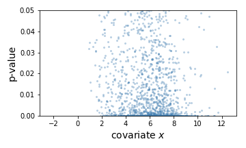
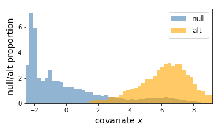
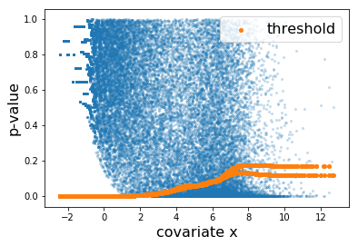

## AdaFDR
A fast and covariate-adaptive method for multiple hypothesis testing.

## Installation
```
pip install adafdr
```

## Usage
`adafdr` mainly offers two methods: `adafdr_explore` for covariate visualization and 
`adafdr_test` for multiple hypothesis testing. 

### Import package and load data
`adafdr.method` contains the algorithm implementation while `adafdr.data_loader` can be 
used to load the data used in the paper. 
```python
import adafdr.method as md
import adafdr.data_loader as dl
p,x = dl.data_airway()
```
The data `p,x` has the following format:
* `p`: (N,) numpy.ndarray, p-values for N hypotheses.
* `x`: (N,d) numpy.ndarray, d-dimensional covariate for each hypothesis. When d=1, 
`x` is allowed to be (N,) numpy.ndarray or (N,1) numpy.ndarray.

### Covariate visualization using adafdr_explore
```python
md.adafdr_explore(p, x, output_folder=None)
```

 

If `output_folder` is a folder path, figures will be saved to the folder instead of being plotted 
in the console.

Here, the left is a scatter plot of each hypothesis with p-values (y-axis) against the covariate (x-axis). 
The right is the estimated null hypothesis distribution (blue) and the estimated alternative hypothesis 
distribution (orange) with respect to the covariate. Here we can conclude that a hypothesis is morelikely
to be significant if the covariate (gene expression) value is larger.

### Multiple hypothesis testing using adafdr_test
```python
n_rej,t_rej,theta = md.adafdr_test(p, x, fast_mode=True, output_folder=None)
```
* If 'fast_mode' is True, *AdaFDR-fast* is used, otherwise, *AdaFDR* is used.
* If `output_folder` is a folder path, log files will be saved in the folder. 
* `n_rej` is the number of rejections, `t_rej` is a (N,) numpy.ndarray for decision threshold for each hypothesis,
`theta` is a of learned parameters.

Here, the learned threshold looks like. Note that the two lines correspond to the data in two folds via
hypothesis splitting


## Quick Test
